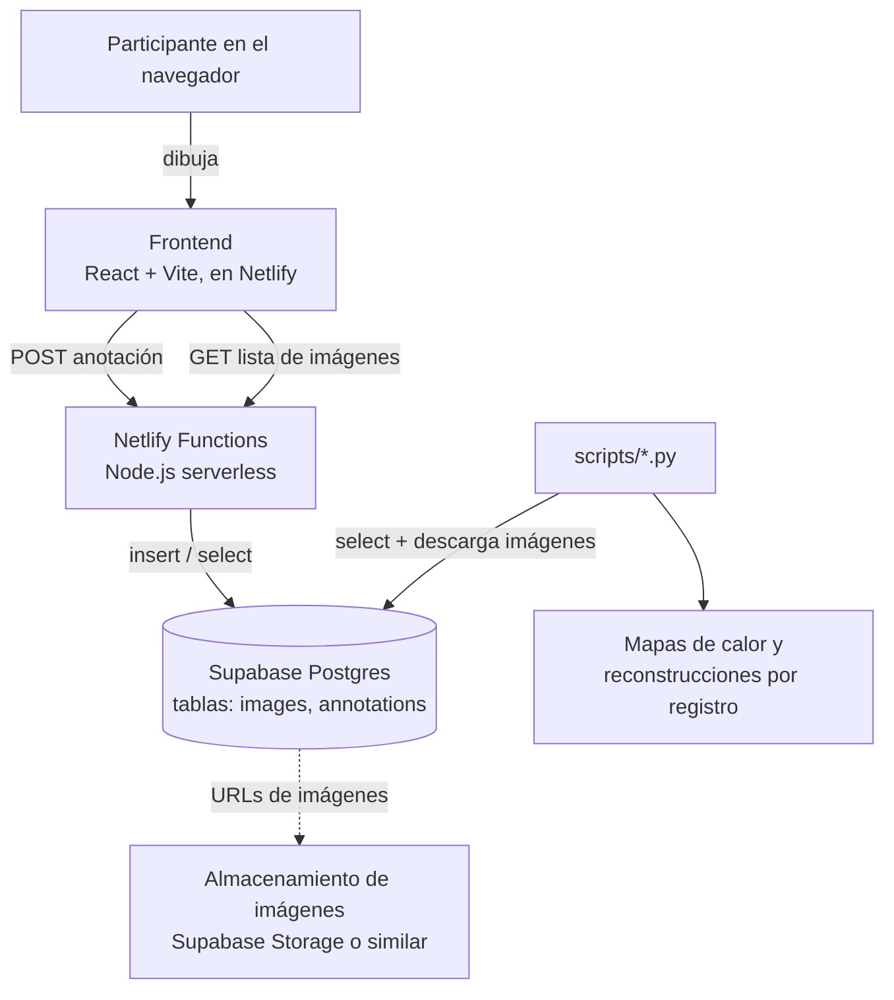

# Saliency — Estudio de atención visual en anuncios

Sitio web para estudios de atención visual: a cada participante se le
muestra una serie de imágenes (anuncios), marca con un pincel la
primera zona en la que se fijó, y esos datos se guardan para construir
mapas de calor de atención por imagen.

## 1. Arquitectura



- **Frontend**: React + Vite + Tailwind. Vive en `src/App.tsx`.
- **Backend**: Netlify Functions (`netlify/functions/`), sin servidor propio que mantener.
- **Base de datos**: Supabase (Postgres), con dos tablas: `images` (catálogo de imágenes del estudio) y `annotations` (un registro por cada imagen que anotó cada participante).
- **Análisis**: scripts de Python en `scripts/`, independientes del sitio web, que se conectan directamente a Supabase para generar mapas de calor y reconstrucciones visuales.

## 2. Estructura del repositorio

```
src/App.tsx                  -- toda la aplicación (pantallas, lienzo, lógica)
src/index.css                -- estilos globales y variables de color (tema)
src/main.tsx                 -- punto de entrada de React
netlify/functions/
  annotations.ts             -- POST: guarda una anotación en Supabase
  images.ts                  -- GET: devuelve la lista de imágenes activas
netlify.toml                 -- configuración de build y de netlify dev
vite.config.ts               -- configuración de Vite
scripts/
  generar_mapas_calor.py             -- mapa de calor agregado por imagen
  generar_dibujos_por_registro.py    -- una imagen por cada anotación guardada
  generar_dibujos_por_participante.py -- igual, nombrado por participante
  requirements.txt           -- dependencias de Python para los scripts
package.json                 -- dependencias y scripts (usa pnpm)
```

## 3. Requisitos previos

- Node.js (trae npm)
- `pnpm` como gestor de paquetes:
  ```
  corepack enable
  corepack prepare pnpm@latest --activate
  ```
- En Windows: activar el **Modo de desarrollador** (Configuración → Privacidad y seguridad → Para desarrolladores) — Netlify CLI necesita crear symlinks al empaquetar las funciones, y Windows lo bloquea por defecto sin esto.
- Una cuenta de [Supabase](https://supabase.com) (plan gratuito es suficiente) y una de [Netlify](https://netlify.com).

## 4. Configuración local

1. Clona el repositorio e instala dependencias:
   ```
   git clone https://github.com/Menteenblanc0/Saliency.git
   cd Saliency
   pnpm install
   ```
   Si `pnpm` pregunta por scripts de instalación bloqueados, corre `pnpm approve-builds` y aprueba todos.

2. Instala Netlify CLI (si no lo tienes):
   ```
   pnpm add -D netlify-cli
   ```

3. Crea un archivo `.env` en la raíz del proyecto:
   ```
   SUPABASE_URL=https://tu-proyecto.supabase.co
   SUPABASE_SERVICE_ROLE_KEY=tu_service_role_key
   ```
   Ambos valores están en tu proyecto de Supabase: **Project Settings → API**. Usa la key `service_role` (secreta, con permisos totales), no la `anon`.

4. Corre el proyecto:
   ```
   pnpm exec netlify dev
   ```
   Esto levanta el frontend (Vite) y las funciones serverless juntas, normalmente en `http://localhost:8888`.

## 5. Base de datos (Supabase)

Corre esto una sola vez en **Supabase → SQL Editor**, en el orden dado:

```sql
create extension if not exists pgcrypto;

create table if not exists images (
  id uuid primary key default gen_random_uuid(),
  url text not null,
  alt text,
  active boolean not null default true,
  created_at timestamptz not null default now()
);

create table if not exists annotations (
  id uuid primary key default gen_random_uuid(),
  participant_id uuid not null,
  image_id text not null,
  strokes jsonb not null,
  created_at timestamptz not null default now()
);

create index if not exists idx_annotations_image_id on annotations (image_id);
create unique index if not exists idx_annotations_unique_submission
  on annotations (participant_id, image_id);
```

### Formato de `strokes` (columna `jsonb`)

Cada anotación guarda un arreglo de trazos, en el orden real en que se dibujaron:

```json
[
  { "tool": "brush", "size": 0.02, "points": [{ "x": 0.51, "y": 0.30 }, ...] },
  { "tool": "eraser", "size": 0.03, "points": [...] }
]
```

`x`, `y` y `size` están **normalizados entre 0 y 1** (fracción del ancho/alto real de la imagen en el navegador de cada participante) — así los datos son comparables sin importar el tamaño de pantalla de cada quien. El primer trazo de tipo `"brush"` en el arreglo es "la primera zona que miró" esa persona.

## 6. Cargar o reemplazar las imágenes del estudio

Sube tus imágenes a un bucket público de **Supabase Storage** (Storage → crea un bucket, ej. `study-images`, márcalo público), copia la URL pública de cada una, e insértalas:

```sql
insert into images (url, alt) values
  ('https://tu-proyecto.supabase.co/storage/v1/object/public/study-images/anuncio-01.jpg', 'Anuncio de zapatillas'),
  ('https://tu-proyecto.supabase.co/storage/v1/object/public/study-images/anuncio-02.jpg', 'Anuncio de bebida energética');
```

El sitio se adapta solo a cuántas imágenes haya (contador, barra de progreso, orden aleatorio) — no hay que tocar código sin importar si son 5 o 500. Para reemplazar todo el set de una vez: `delete from images;` y vuelve a insertar.

## 7. Despliegue en Netlify

1. Sube tus cambios a GitHub (`git push`).
2. En [app.netlify.com](https://app.netlify.com): **Add new site → Import an existing project → GitHub** → selecciona el repositorio.
3. Netlify detecta `netlify.toml` automáticamente (build command `pnpm build`, publish `dist`, functions `netlify/functions`).
4. Antes o después del primer deploy, ve a **Site configuration → Environment variables** y agrega `SUPABASE_URL` y `SUPABASE_SERVICE_ROLE_KEY` con los mismos valores de tu `.env` local. Si las agregas después del primer deploy, tienes que forzar uno nuevo (**Deploys → Trigger deploy → Clear cache and deploy site**) para que se apliquen.
5. Prueba el flujo completo en la URL pública y confirma en Supabase que las anotaciones se están guardando.

## 8. Scripts de análisis (`scripts/`)

Tres scripts de Python, independientes del sitio, que se conectan directamente a Supabase con la misma `service_role` key:

| Script | Qué genera |
|---|---|
| `generar_mapas_calor.py` | Un mapa de calor agregado por imagen, acumulando la primera zona marcada por todos los participantes que la anotaron. |
| `generar_dibujos_por_registro.py` | Una imagen por cada fila de `annotations`, mostrando exactamente lo que esa persona dibujó (nombrada por el id de la anotación). |
| `generar_dibujos_por_participante.py` | Igual que el anterior, pero el archivo se nombra `{participant_id}__{image_id}.png` para ubicar fácil todo lo que anotó una persona en concreto. |

Instalación y uso (igual para los tres):
```
cd scripts
pip install -r requirements.txt
```
Crea un `.env` dentro de `scripts/` con las mismas dos variables de Supabase, y corre el script que necesites (`python generar_mapas_calor.py`, etc.). Cada uno crea su propia carpeta de salida junto al script, con las imágenes generadas y un archivo de resumen/manifiesto en JSON.
